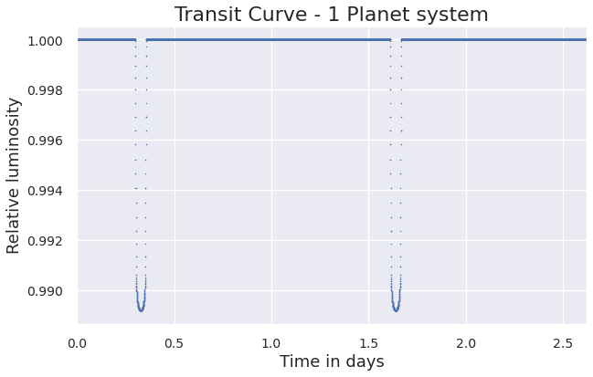

# ExoplanetPy 

ExoplanetPy is a python package for modelling the transit light curves of systems with multiple exoplanets orbiting around their host stars.  
To obtain transit curves, simply set up the Keplerian orbital elements for each planet in the system.


The `Planet()` class handles each planet's orbital elements, and the `System()` class can be used to plot the final transit curves.

The following orbital elements are set up:
| **Variable** | **Element** |
| ------ | ------ |
| *e* | eccentricity |
| *a* | semi-major axis |
| *omega* | argument of periapsis (ω) |
| *Omega* | longitude of ascending node (Ω) |
| *i* | orbital inclination |
| *r_p* | planet:star radius |

Each `Planet()` can have different initial true anomaly (ν) values, varied by the `first_periastron` time argument.

## Usage
Modules can be accessed using the following imports.
```python
from ExoplanetPy import Planet
from ExoplanetPy import System
```

Define a single `Planet()` and input as `planet_list` argument in `System()`.  
Limb darkening models are chosen in the `plot()` method.
```python
p1 = Planet(e=0.0, a=8, omega=0, Omega=0, i=89.9, r_p=0.1, first_periastron=0.0)
sys = System(star_prop={'Mass': 4}, planet_list=[p1], sort=True)
sys.plot(model='Quadratic', normalise=True)
```


Additional `Planet()` objects are inputted as `planet_list` argument in `System()`.
```python
p1 = Planet(e=0.0, a=8, omega=0, Omega=0, i=89.9, r_p=0.1, first_periastron=0.0)
p2 = Planet(e=0.0, a=2, omega=0, Omega=0, i=89.9, r_p=0.05, first_periastron=0.0)
sys = System(star_prop={'Mass': 4}, planet_list=[p1,p2], sort=True)
sys.plot(model='Quadratic', normalise=True)
```


## Dependencies
ExoplanetPy has the following dependencies:
* [NumPy](https://numpy.org/)
* [SciPy](https://www.scipy.org/)
* [Matplotlib](https://matplotlib.org/)  (produce plots)
* [Seaborn](https://seaborn.pydata.org/) (stylize plots)

## License 
MIT License  
© 2020 ExoplanetPy
