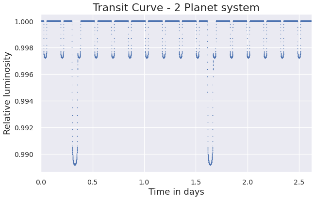

# ExoplanetPy 

ExoplanetPy is a python package for modelling the transit light curves of systems with multiple exoplanets orbiting around their host stars.
To obtain transit curves, input the Keplerian orbital elements for each planet in the system.

```python
p1 = Planet(e=0.0, a=8, omega=0, Omega=0, i=89.9, r_p=0.1, first_periastron=0.0)
sys = System(star_prop={'Mass': 4}, planet_list=[p1], sort=True)
sys.plot(model='Quadratic', normalise=True)
```


```python
p1 = Planet(e=0.0, a=8, omega=0, Omega=0, i=89.9, r_p=0.1, first_periastron=0.0)
p2 = Planet(e=0.0, a=2, omega=0, Omega=0, i=89.9, r_p=0.05, first_periastron=0.0)
sys = System(star_prop={'Mass': 4}, planet_list=[p1], sort=True)
sys.plot(model='Quadratic', normalise=True)
```

